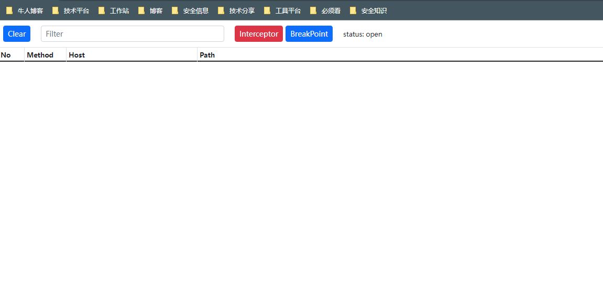

# vela-mitm
> vela mitmproxy framework

## 使用
默认web管理后台端口port+1 如：port=9080 , web=9081
```bash
   go build   
   
   ./vela-mitm --help
   -bind string
        bind addr
   -large int
        stream large body (default 5242880)
   -port int
        listen port (default 9080)
```

## web过滤
主要是breakpoint的抓包规则

- condit

满足 github.com/vela-ssoc/vela-cond 的规则语法
- host
- uri
- request
- query
- ua
- body

其次 h_referer , 所有以h_开头的都是读取header内容; a_name 类似读取arg的name字段

```bash
    host      = www.vela-ssoc.com
    a_name    = ssoc 
    h_referer = https://www.vela-ssoc.com
```

- script

满足规则脚本进行拦截匹配

```lua
    if flow.uri.re("(css|js|jpg|png)$") then flow.pass() end
    if flow.uri.eq("/api") and flow.a_name.eq("ssoc") then flow.wait() end
```

## 样例




